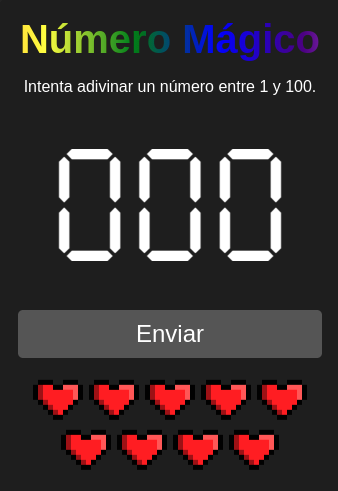

# 🎮 Juego del Número Mágico

Este proyecto es un juego web interactivo desarrollado utilizando HTML, CSS y JavaScript



## 📜 Descripción
El "Juego del Número Mágico" es un juego interactivo donde los jugadores intentan adivinar un número aleatorio entre 1 y 100. El juego proporciona retroalimentación sobre si el número ingresado es mayor o menor que el número objetivo. Los jugadores tienen un número limitado de intentos para adivinar correctamente.

## 🌟 Características
- 🎨 Interfaz de usuario atractiva con animaciones.
- 🎉 Efecto de confeti al adivinar correctamente el número.
- ❤️ Indicadores visuales (corazones) que muestran los intentos restantes.
- 📣 Mensajes de retroalimentación que indican si el número es mayor o menor.
- 🌈 Gradiente de arcoíris en el título que se mueve continuamente.

## 🛠️ Tecnologías Utilizadas
- HTML
- CSS
- JavaScript
- Canvas para efectos de confeti

## 📥 Instalación
1. Clona el repositorio:
   ```bash
   git clone https://github.com/camilo-845/juego-numero-magico.git
   ```
2. Navega al directorio del proyecto:
   ```bash
   cd juego-numero-magico
   ```
3. Abre el archivo `index.html` en tu navegador.

## 🕹️ Uso
1. Ingresa un número entre 1 y 100 en el campo de entrada.
2. Haz clic en el botón "Enviar" para verificar tu conjetura.
3. Recibirás retroalimentación sobre si el número es mayor o menor que el número objetivo.
4. Continúa adivinando hasta que adivines correctamente o se agoten tus intentos.